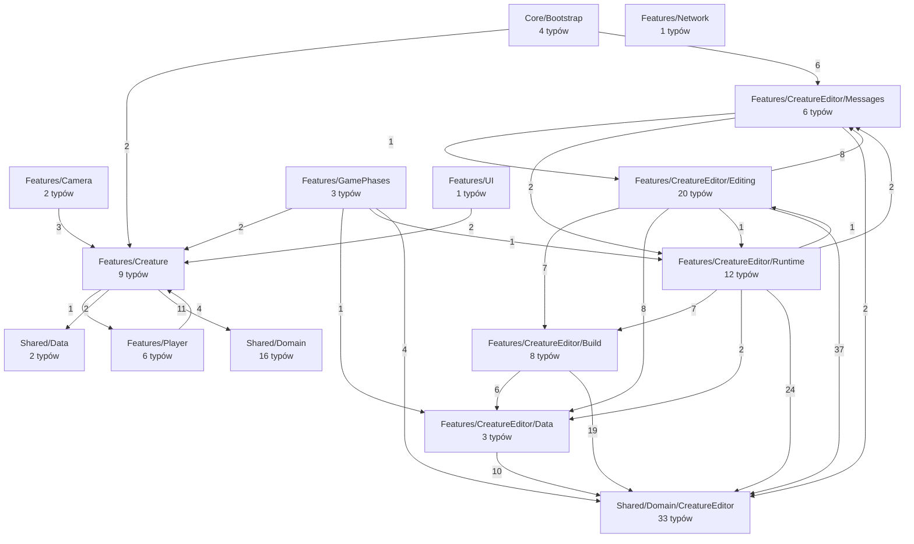

<!-- PLIK GENEROWANY — nie edytuj ręcznie. Źródło: Tools/DiagramGen/gen.mjs -->

# Przegląd — zależności między obszarami

Węzeł to katalog, liczba na strzałce to ile par typów tworzy tę zależność.
Strzałka w stronę `Shared/Domain` jest zdrowa; strzałka **z** `Shared/Domain`
w stronę `Features` oznaczałaby, że domena zaczęła zależeć od Unity i sieci.

## Diagramy klas

- [Core/Bootstrap](./klasy-core-bootstrap.md) — 4 typów
- [Features/Camera](./klasy-features-camera.md) — 2 typów
- [Features/Creature](./klasy-features-creature-scripts.md) — 9 typów
- [Features/CreatureEditor/Build](./klasy-features-creatureeditor-scripts-build.md) — 8 typów
- [Features/CreatureEditor/Data](./klasy-features-creatureeditor-scripts-data.md) — 3 typów
- [Features/CreatureEditor/Editing](./klasy-features-creatureeditor-scripts-editing.md) — 20 typów
- [Features/CreatureEditor/Messages](./klasy-features-creatureeditor-scripts-messages.md) — 6 typów
- [Features/CreatureEditor/Runtime](./klasy-features-creatureeditor-scripts-runtime.md) — 12 typów
- [Features/GamePhases](./klasy-features-gamephases.md) — 3 typów
- [Features/Network](./klasy-features-network.md) — 1 typów
- [Features/Player](./klasy-features-player-scripts.md) — 6 typów
- [Features/UI](./klasy-features-ui.md) — 1 typów
- [Shared/Data](./klasy-shared-data.md) — 2 typów
- [Shared/Domain](./klasy-shared-domain.md) — 16 typów
- [Shared/Domain/CreatureEditor](./klasy-shared-domain-creatureeditor.md) — 33 typów
