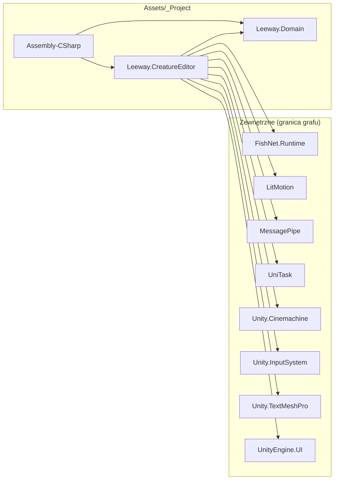

<!-- PLIK GENEROWANY — nie edytuj ręcznie. Źródło: Tools/DiagramGen/gen.mjs -->

# Graf assembly (asmdef)

Najgrubsza granica w projekcie. Assembly to jedyny poziom, na którym Unity
faktycznie *wymusza* kierunek zależności — czego tu nie ma, tego kod nie
skompiluje. Dlatego ten diagram jest kontraktem, a nie opisem.

| Assembly | Typów |
|---|---|
| `Assembly-CSharp` | 28 |
| `Leeway.CreatureEditor` | 49 |
| `Leeway.Domain` | 49 |
