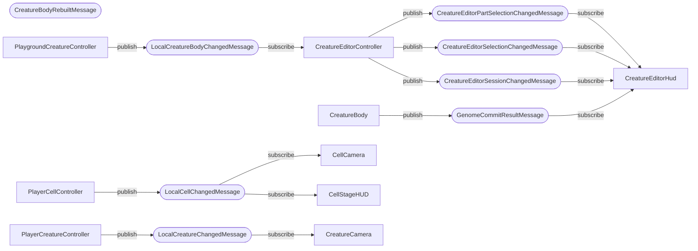

<!-- PLIK GENEROWANY — nie edytuj ręcznie. Źródło: Tools/DiagramGen/gen.mjs -->

# Przepływ komunikatów (MessagePipe)

Ta zależność **nie jest widoczna w kodzie ani w grafie assembly** — nadawca i
odbiorca nie znają się nawzajem, łączy ich wyłącznie typ komunikatu. Bez tego
diagramu jest niewidzialna.

| Komunikat | Zarejestrowany | Publikuje | Subskrybuje |
|---|---|---|---|
| `CreatureBodyRebuiltMessage` | tak | — | — |
| `CreatureEditorPartSelectionChangedMessage` | tak | CreatureEditorController | CreatureEditorHud |
| `CreatureEditorSelectionChangedMessage` | tak | CreatureEditorController | CreatureEditorHud |
| `CreatureEditorSessionChangedMessage` | tak | CreatureEditorController | CreatureEditorHud |
| `GenomeCommitResultMessage` | tak | CreatureBody | CreatureEditorHud |
| `LocalCellChangedMessage` | tak | PlayerCellController | CellCamera, CellStageHUD |
| `LocalCreatureBodyChangedMessage` | tak | PlaygroundCreatureController | CreatureEditorController |
| `LocalCreatureChangedMessage` | tak | PlayerCreatureController | CreatureCamera |

> **Zarejestrowane, ale nigdzie nieużywane:** `CreatureBodyRebuiltMessage`.
