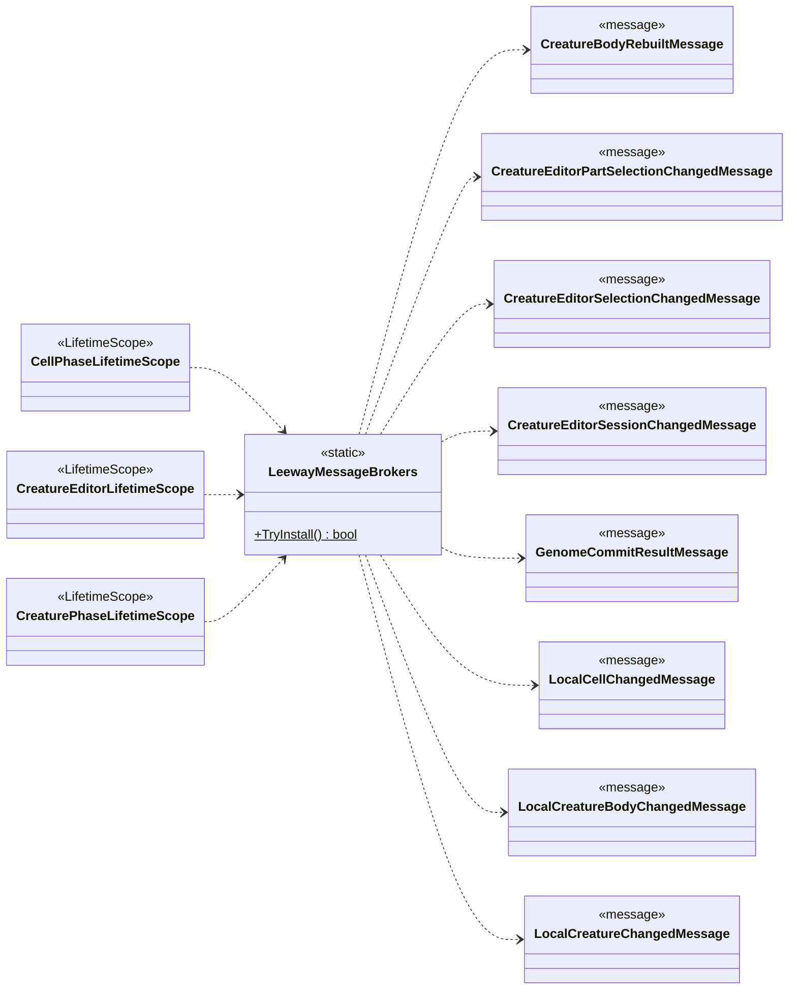

<!-- PLIK GENEROWANY — nie edytuj ręcznie. Źródło: Tools/DiagramGen/gen.mjs -->

# Core/Bootstrap

**Puste pudełka** to typy z innych obszarów, pokazane tylko dla kontekstu: `CreatureBodyRebuiltMessage`, `CreatureEditorPartSelectionChangedMessage`, `CreatureEditorSelectionChangedMessage`, `CreatureEditorSessionChangedMessage`, `GenomeCommitResultMessage`, `LocalCellChangedMessage`, `LocalCreatureBodyChangedMessage`, `LocalCreatureChangedMessage`.

Pliki źródłowe (4)

- `Assets/_Project/Core/Bootstrap/CellPhaseLifetimeScope.cs`
- `Assets/_Project/Core/Bootstrap/CreatureEditorLifetimeScope.cs`
- `Assets/_Project/Core/Bootstrap/CreaturePhaseLifetimeScope.cs`
- `Assets/_Project/Core/Bootstrap/LeewayMessageBrokers.cs`

