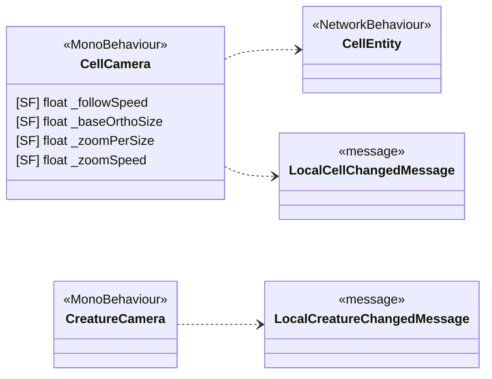

<!-- PLIK GENEROWANY — nie edytuj ręcznie. Źródło: Tools/DiagramGen/gen.mjs -->

# Features/Camera

**Puste pudełka** to typy z innych obszarów, pokazane tylko dla kontekstu: `CellEntity`, `LocalCellChangedMessage`, `LocalCreatureChangedMessage`.

Pliki źródłowe (2)

- `Assets/_Project/Features/Camera/Scripts/CellCamera.cs`
- `Assets/_Project/Features/Camera/Scripts/CreatureCamera.cs`

