<!-- PLIK GENEROWANY — nie edytuj ręcznie. Źródło: Tools/DiagramGen/gen.mjs -->

# Features/Creature

```mermaid
classDiagram
    direction LR
    class CellEntity {
        <<NetworkBehaviour>>
        [SF] CellEntityConfig _config
        [Sync] float _size
        [Sync] float _hp
        [Sync] bool _isAlive
        +CellEntityConfig Config
        +float Size
        +float Hp
        +bool IsAlive
        +float CurrentSpeed
        +event SizeChanged
        +event HpChanged
        +event Died
        +CanEat(CellEntity) bool
        [Server] +TryEat(Collider2D) void
        +… i 4 dalszych
    }
    class CellVisuals {
        <<MonoBehaviour>>
        [SF] float _wobbleSpeed
        [SF] float _wobbleAmount
        [SF] float _pulseSpeed
        [SF] float _pulseAmount
    }
    class CreatureEntity {
        <<NetworkBehaviour>>
        [SF] CreatureEntityConfig _config
        [Sync] float _hp
        [Sync] float _food
        [Sync] bool _isAlive
        +CreatureEntityConfig Config
        +float Hp
        +float Food
        +bool IsAlive
        +float CurrentSpeed
        +event HpChanged
        +event FoodChanged
        +event Died
        +CanAttack(CreatureEntity) bool
        [Server] +TryAttack(CreatureEntity) void
        +… i 4 dalszych
    }
    class CreatureVisuals {
        <<MonoBehaviour>>
        [SF] Renderer[] _renderers
        [SF] Color _healthyColor
        [SF] Color _lowHpColor
    }
    class FoodItem {
        <<NetworkBehaviour>>
        [SF] float _foodAmount
        +event Collected
        [Server] +Consume(CreatureEntity) void
    }
    class LocalCellChangedMessage {
        <<message>>
        +CellEntity Cell
    }
    class LocalCreatureChangedMessage {
        <<message>>
        +CreatureEntity Creature
    }
    class NpcCellController {
        <<NetworkBehaviour>>
        [SF] NpcType _npcType
        [SF] float _chaseRadius
        [SF] float _fleeRadius
        [SF] float _wanderRadius
        [SF] float _directionChangeInterval
    }
    class NpcCreatureController {
        <<NetworkBehaviour>>
        [SF] NpcCreatureType _npcType
        [SF] float _senseRadius
        [SF] float _fleeRadius
        [SF] float _wanderRadius
        [SF] float _directionChangeInterval
        [SF] float _attackCooldown
        +NpcCreatureType NpcType
    }
    class CellEntityConfig {
        <<ScriptableObject>>
    }
    class CellRules {
        <<static>>
    }
    class CreatureEntityConfig {
        <<ScriptableObject>>
    }
    class CreaturePerception {
        <<domain>>
    }
    class CreatureRules {
        <<static>>
    }
    class INpcBehavior {
        <<interface>>
    }
    class INpcCreatureBehavior {
        <<interface>>
    }
    class NpcBehaviorFactory {
        <<static>>
    }
    class NpcCreatureBehaviorFactory {
        <<static>>
    }
    class NpcCreatureType {
        <<enum>>
    }
    class NpcPerception {
        <<domain>>
    }
    class NpcType {
        <<enum>>
    }
    class PlayerCellController {
        <<NetworkBehaviour>>
    }
    class PlayerCreatureController {
        <<NetworkBehaviour>>
    }

    CellEntity --> CellEntityConfig : inspektor
    CellEntity ..> CellRules
    CellVisuals ..> CellEntity
    CreatureEntity --> CreatureEntityConfig : inspektor
    CreatureEntity ..> CreatureRules
    CreatureEntity ..> FoodItem
    CreatureVisuals ..> CreatureEntity
    FoodItem --> CreatureEntity
    LocalCellChangedMessage --> CellEntity
    LocalCreatureChangedMessage --> CreatureEntity
    CellEntity <|-- NpcCellController
    NpcCellController ..> INpcBehavior
    NpcCellController ..> NpcBehaviorFactory
    NpcCellController ..> NpcPerception
    NpcCellController --> NpcType : inspektor
    CreatureEntity <|-- NpcCreatureController
    NpcCreatureController ..> CreaturePerception
    NpcCreatureController ..> INpcCreatureBehavior
    NpcCreatureController ..> NpcCreatureBehaviorFactory
    NpcCreatureController --> NpcCreatureType : inspektor
    NpcCreatureController ..> NpcType
    NpcCreatureController ..> PlayerCreatureController
    CellEntity <|-- PlayerCellController
    CreatureEntity <|-- PlayerCreatureController
```

**Puste pudełka** to typy z innych obszarów, pokazane tylko dla kontekstu: `CellEntityConfig`, `CellRules`, `CreatureEntityConfig`, `CreaturePerception`, `CreatureRules`, `INpcBehavior`, `INpcCreatureBehavior`, `NpcBehaviorFactory`, `NpcCreatureBehaviorFactory`, `NpcCreatureType`, `NpcPerception`, `NpcType`, `PlayerCellController`, `PlayerCreatureController`.

Pliki źródłowe (9)

- `Assets/_Project/Features/Creature/Scripts/CellEntity.cs`
- `Assets/_Project/Features/Creature/Scripts/CellVisuals.cs`
- `Assets/_Project/Features/Creature/Scripts/CreatureEntity.cs`
- `Assets/_Project/Features/Creature/Scripts/CreatureVisuals.cs`
- `Assets/_Project/Features/Creature/Scripts/FoodItem.cs`
- `Assets/_Project/Features/Creature/Scripts/LocalCellChangedMessage.cs`
- `Assets/_Project/Features/Creature/Scripts/LocalCreatureChangedMessage.cs`
- `Assets/_Project/Features/Creature/Scripts/NpcCellController.cs`
- `Assets/_Project/Features/Creature/Scripts/NpcCreatureController.cs`

