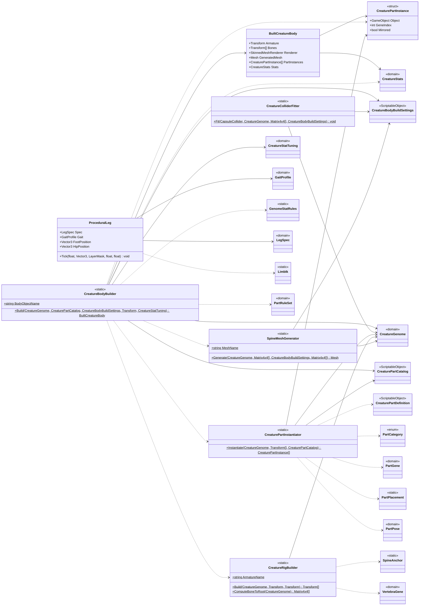

<!-- PLIK GENEROWANY — nie edytuj ręcznie. Źródło: Tools/DiagramGen/gen.mjs -->

# Features/CreatureEditor/Build

**Puste pudełka** to typy z innych obszarów, pokazane tylko dla kontekstu: `CreatureBodyBuildSettings`, `CreatureGenome`, `CreaturePartCatalog`, `CreaturePartDefinition`, `CreatureStatTuning`, `CreatureStats`, `GaitProfile`, `GenomeStatRules`, `LegSpec`, `LimbIk`, `PartCategory`, `PartGene`, `PartPlacement`, `PartPose`, `PartRuleSet`, `SpineAnchor`, `VertebraGene`.

Pliki źródłowe (7)

- `Assets/_Project/Features/CreatureEditor/Scripts/Build/BuiltCreatureBody.cs`
- `Assets/_Project/Features/CreatureEditor/Scripts/Build/CreatureBodyBuilder.cs`
- `Assets/_Project/Features/CreatureEditor/Scripts/Build/CreatureColliderFitter.cs`
- `Assets/_Project/Features/CreatureEditor/Scripts/Build/CreaturePartInstantiator.cs`
- `Assets/_Project/Features/CreatureEditor/Scripts/Build/CreatureRigBuilder.cs`
- `Assets/_Project/Features/CreatureEditor/Scripts/Build/ProceduralLeg.cs`
- `Assets/_Project/Features/CreatureEditor/Scripts/Build/SpineMeshGenerator.cs`

