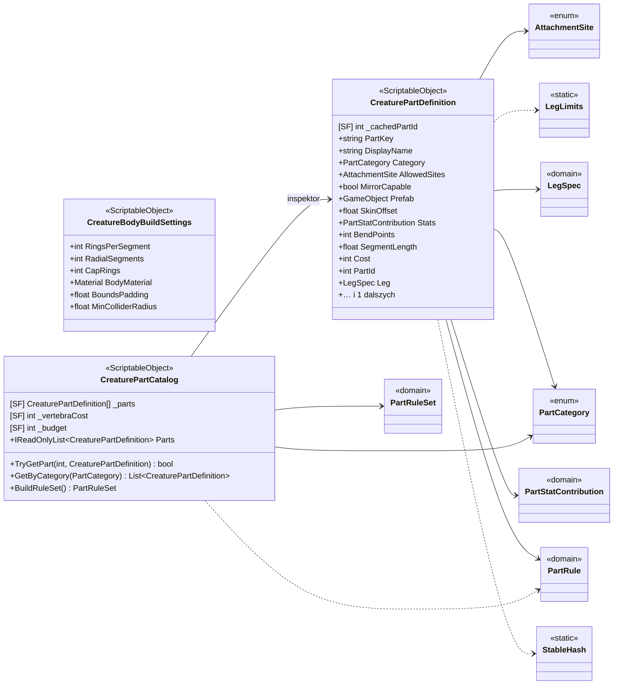

<!-- PLIK GENEROWANY — nie edytuj ręcznie. Źródło: Tools/DiagramGen/gen.mjs -->

# Features/CreatureEditor/Data

**Puste pudełka** to typy z innych obszarów, pokazane tylko dla kontekstu: `AttachmentSite`, `LegLimits`, `LegSpec`, `PartCategory`, `PartRule`, `PartRuleSet`, `PartStatContribution`, `StableHash`.

Pliki źródłowe (3)

- `Assets/_Project/Features/CreatureEditor/Scripts/Data/CreatureBodyBuildSettings.cs`
- `Assets/_Project/Features/CreatureEditor/Scripts/Data/CreaturePartCatalog.cs`
- `Assets/_Project/Features/CreatureEditor/Scripts/Data/CreaturePartDefinition.cs`

