<!-- PLIK GENEROWANY — nie edytuj ręcznie. Źródło: Tools/DiagramGen/gen.mjs -->

# Features/CreatureEditor/Editing

```mermaid
classDiagram
    direction LR
    class CreatureBodyPreview {
        <<MonoBehaviour>>
        [SF] CreaturePartCatalog _catalog
        [SF] CreatureBodyBuildSettings _settings
        [SF] CreatureStatTuning _tuning
        [SF] CapsuleCollider _corpusCollider
        [SF] int _starterSeed
        [SF] bool _drawBoneGizmos
        +bool IsVisible
        +CreatureGenome Genome
        +BuiltCreatureBody Body
        +CreaturePartCatalog Catalog
        +PartRuleSet Rules
        +event CreatureStats
        +SetGenome(CreatureGenome) void
        +SetVisible(bool) void
        +… i 5 dalszych
    }
    class CreatureEditorCameraRig {
        <<MonoBehaviour>>
        [SF] CinemachineCamera _sculptCamera
        [SF] CinemachineCamera _playCamera
        [SF] Transform _sculptTarget
        +CreatureEditorMode Mode
        +SetMode(CreatureEditorMode) void
        +Toggle() void
        +SetPlayTarget(Transform) void
    }
    class CreatureEditorController {
        <<MonoBehaviour>>
        [SF] CreatureEditorInput _input
        [SF] CreatureEditorSession _session
        [SF] CreatureBodyPreview _preview
        [SF] VertebraHandleSet _handles
        [SF] PartRotationGizmo _rotationGizmo
        [SF] SpineExtendGizmo _extendGizmo
        [SF] PartDragGhost _ghost
        [SF] CreatureEditorCameraRig _cameraRig
        [SF] LayerMask _handleMask
        [SF] LayerMask _bodyMask
        [SF] float _radiusStep
        [SF] float _clickSlopPixels
        +CreatureEditorMode Mode
        +ToggleSelectedPartMirror() void
        +… i 5 dalszych
    }
    class CreatureEditorHud {
        <<MonoBehaviour>>
        [SF] CreatureEditorController _controller
        [SF] Button _applyButton
        [SF] Button _revertButton
        [SF] Button _mirrorButton
        [SF] TextMeshProUGUI _statsText
        [SF] TextMeshProUGUI _statusText
        [SF] TextMeshProUGUI _selectionText
    }
    class CreatureEditorInput {
        <<MonoBehaviour>>
        +Vector2 PointerPosition
        +Vector2 PointerDelta
        +bool IsDragging
        +bool IsOrbiting
        +float ZoomDelta
        +event SelectPressed
        +event SelectReleased
        +event AddVertebraPressed
        +event RemoveVertebraPressed
        +event ToggleModePressed
        +event ApplyPressed
        +event RevertPressed
        +event CycleSelectionPressed
        +event ToggleSymmetryPressed
    }
    class CreatureEditorMode {
        <<enum>>
    }
    class CreatureEditorOrbitInput {
        <<MonoBehaviour>>
        [SF] CreatureEditorInput _input
        [SF] CinemachineOrbitalFollow _orbit
        [SF] float _horizontalSpeed
        [SF] float _verticalSpeed
        [SF] bool _invertVertical
    }
    class CreatureEditorSession {
        <<MonoBehaviour>>
        [SF] CreatureBodyPreview _preview
        +CreatureGenome Working
        +PartRuleSet Rules
        +int SelectedVertebra
        +bool HasUnappliedChanges
        +event WorkingGenomeChanged
        +event SelectionChanged
        +event EditRejected
        +Begin(CreatureGenome) void
        +Revert() void
        +MarkApplied() void
        +Select(int) void
        +AddVertebra() bool
        +ExtendSpine(bool) bool
        +… i 13 dalszych
    }
    class CreatureOrbitCamera {
        <<MonoBehaviour>>
        [SF] CinemachineCamera _playCamera
        [SF] Vector3 _baseOffset
        [SF] float _sensitivity
        [SF] float _damping
        +float Yaw
    }
    class CreaturePaletteItem {
        <<MonoBehaviour>>
        +Bind(CreatureEditorController, int, bool) void
        +OnPointerDown(PointerEventData) void
        +OnPointerUp(PointerEventData) void
        +OnBeginDrag(PointerEventData) void
        +OnDrag(PointerEventData) void
        +OnEndDrag(PointerEventData) void
    }
    class CreaturePartPalette {
        <<MonoBehaviour>>
        [SF] CreatureEditorController _controller
        [SF] CreaturePartCatalog _catalog
        [SF] Button _itemTemplate
        [SF] Button _tabTemplate
        [SF] Transform _itemContainer
        [SF] Transform _tabContainer
        [SF] Color _activeTabColor
        [SF] Color _inactiveTabColor
        [SF] bool _mirrorWhenPossible
        +Rebuild() void
        +ShowCategory(PartCategory) void
    }
    class GizmoAxis {
        <<enum>>
    }
    class PartDragGhost {
        <<MonoBehaviour>>
        [SF] CreaturePartCatalog _catalog
        [SF] float _freeDistance
        [SF] Color _validColor
        [SF] Color _invalidColor
        +bool IsVisible
        +Show(int) void
        +Hide() void
        +Place(Vector3, Quaternion) void
        +FollowPointer(UnityEngine.Camera, Vector2) void
        +SetOverBody(bool) void
    }
    class PartHandle {
        <<MonoBehaviour>>
        +int GeneIndex
        +bool Mirrored
        +Bind(int, bool, Color) void
        +SetHighlighted(bool) void
    }
    class PartHandleSet {
        <<MonoBehaviour>>
        [SF] CreatureBodyPreview _preview
        [SF] int _handleLayer
        [SF] float _hitPadding
        [SF] Color _highlightColor
        +IReadOnlyList~PartHandle~ Handles
        +Rebuild() void
    }
    class PartRotationGizmo {
        <<MonoBehaviour>>
        [SF] Material _ringMaterial
        [SF] float _radius
        [SF] float _thickness
        [SF] float _hitTolerance
        +bool IsVisible
        +Vector3 WorldCenter
        +Place(Vector3, Quaternion) void
        +Hide() void
        +SetHighlighted(GizmoAxis?) void
        +WorldAxis(GizmoAxis) Vector3
        +TryPick(Ray, GizmoAxis, Vector3) bool
        +TryProjectOntoRing(Ray, GizmoAxis, Vector3) bool
    }
    class SpineEnd {
        <<enum>>
    }
    class SpineExtendGizmo {
        <<MonoBehaviour>>
        [SF] Material _material
        [SF] float _length
        [SF] float _thickness
        [SF] float _gap
        [SF] float _hitRadius
        [SF] Color _normalColor
        [SF] Color _highlightColor
        +bool IsVisible
        +Place(Vector3, Vector3, Vector3, Vector3) void
        +Hide() void
        +SetHighlighted(SpineEnd?) void
        +TryPick(Ray, SpineEnd) bool
        +TryGetAxis(SpineEnd, Vector3, Vector3) bool
    }
    class VertebraHandle {
        <<MonoBehaviour>>
        +int VertebraIndex
        +Bind(int, Renderer, Color, Color) void
        +SetHighlighted(bool) void
    }
    class VertebraHandleSet {
        <<MonoBehaviour>>
        [SF] CreatureBodyPreview _preview
        [SF] int _handleLayer
        [SF] GameObject _markerPrefab
        [SF] float _thickness
        [SF] Color _normalColor
        [SF] Color _highlightColor
        +System.Collections.Generic.IReadOnlyList~VertebraHandle~ Handles
        +bool Visible
        +SetVisible(bool) void
        +Rebuild() void
    }
    class BudgetReport {
        <<domain>>
    }
    class BuiltCreatureBody {
    }
    class CreatureBody {
        <<NetworkBehaviour>>
    }
    class CreatureBodyBuildSettings {
        <<ScriptableObject>>
    }
    class CreatureBodyBuilder {
        <<static>>
    }
    class CreatureBudget {
        <<static>>
    }
    class CreatureColliderFitter {
        <<static>>
    }
    class CreatureEditorPartSelectionChangedMessage {
        <<message>>
    }
    class CreatureEditorSelectionChangedMessage {
        <<message>>
    }
    class CreatureEditorSessionChangedMessage {
        <<message>>
    }
    class CreatureGenome {
        <<domain>>
    }
    class CreaturePartCatalog {
        <<ScriptableObject>>
    }
    class CreaturePartDefinition {
        <<ScriptableObject>>
    }
    class CreaturePartInstance {
        <<struct>>
    }
    class CreatureRigBuilder {
        <<static>>
    }
    class CreatureStatTuning {
        <<domain>>
    }
    class CreatureStats {
        <<domain>>
    }
    class GenomeCommitResultMessage {
        <<message>>
    }
    class GenomeEditOperations {
        <<static>>
    }
    class GenomeError {
        <<enum>>
    }
    class GenomeLimits {
        <<static>>
    }
    class GenomeStatRules {
        <<static>>
    }
    class GenomeValidationResult {
        <<domain>>
    }
    class GenomeValidator {
        <<static>>
    }
    class LocalCreatureBodyChangedMessage {
        <<message>>
    }
    class PartCategory {
        <<enum>>
    }
    class PartGene {
        <<domain>>
    }
    class PartPlacement {
        <<static>>
    }
    class PartPose {
        <<domain>>
    }
    class PartRule {
        <<domain>>
    }
    class PartRuleSet {
        <<domain>>
    }
    class StarterGenomeFactory {
        <<static>>
    }

    CreatureBodyPreview --> BuiltCreatureBody
    CreatureBodyPreview ..> CreatureBodyBuilder
    CreatureBodyPreview --> CreatureBodyBuildSettings : inspektor
    CreatureBodyPreview ..> CreatureColliderFitter
    CreatureBodyPreview --> CreatureGenome
    CreatureBodyPreview --> CreaturePartCatalog : inspektor
    CreatureBodyPreview ..> CreaturePartInstance
    CreatureBodyPreview ..> CreatureRigBuilder
    CreatureBodyPreview ..> CreatureStats
    CreatureBodyPreview --> CreatureStatTuning : inspektor
    CreatureBodyPreview ..> GenomeEditOperations
    CreatureBodyPreview ..> GenomeError
    CreatureBodyPreview --> PartRuleSet
    CreatureBodyPreview ..> StarterGenomeFactory
    CreatureEditorCameraRig --> CreatureEditorMode
    CreatureEditorController ..> CreatureBody
    CreatureEditorController --> CreatureBodyPreview : inspektor
    CreatureEditorController --> CreatureEditorCameraRig : inspektor
    CreatureEditorController --> CreatureEditorInput : inspektor
    CreatureEditorController --> CreatureEditorMode
    CreatureEditorController ..> CreatureEditorPartSelectionChangedMessage
    CreatureEditorController ..> CreatureEditorSelectionChangedMessage
    CreatureEditorController --> CreatureEditorSession : inspektor
    CreatureEditorController ..> CreatureEditorSessionChangedMessage
    CreatureEditorController ..> CreatureGenome
    CreatureEditorController ..> CreaturePartCatalog
    CreatureEditorController ..> CreaturePartDefinition
    CreatureEditorController ..> CreaturePartInstance
    CreatureEditorController ..> CreatureStats
    CreatureEditorController ..> GenomeError
    CreatureEditorController ..> GenomeLimits
    CreatureEditorController ..> GenomeValidationResult
    CreatureEditorController ..> GenomeValidator
    CreatureEditorController ..> GizmoAxis
    CreatureEditorController ..> LocalCreatureBodyChangedMessage
    CreatureEditorController ..> PartCategory
    CreatureEditorController --> PartDragGhost : inspektor
    CreatureEditorController ..> PartGene
    CreatureEditorController ..> PartHandle
    CreatureEditorController ..> PartPlacement
    CreatureEditorController ..> PartPose
    CreatureEditorController --> PartRotationGizmo : inspektor
    CreatureEditorController ..> PartRule
    CreatureEditorController ..> SpineEnd
    CreatureEditorController --> SpineExtendGizmo : inspektor
    CreatureEditorController ..> VertebraHandle
    CreatureEditorController --> VertebraHandleSet : inspektor
    CreatureEditorHud ..> BudgetReport
    CreatureEditorHud ..> CreatureBudget
    CreatureEditorHud --> CreatureEditorController : inspektor
    CreatureEditorHud ..> CreatureEditorPartSelectionChangedMessage
    CreatureEditorHud ..> CreatureEditorSelectionChangedMessage
    CreatureEditorHud ..> CreatureEditorSession
    CreatureEditorHud ..> CreatureEditorSessionChangedMessage
    CreatureEditorHud ..> CreatureGenome
    CreatureEditorHud ..> CreatureStats
    CreatureEditorHud ..> CreatureStatTuning
    CreatureEditorHud ..> GenomeCommitResultMessage
    CreatureEditorHud ..> GenomeError
    CreatureEditorHud ..> GenomeStatRules
    CreatureEditorOrbitInput --> CreatureEditorInput : inspektor
    CreatureEditorSession --> CreatureBodyPreview : inspektor
    CreatureEditorSession --> CreatureGenome
    CreatureEditorSession ..> GenomeEditOperations
    CreatureEditorSession --> GenomeError
    CreatureEditorSession --> GenomeValidationResult
    CreatureEditorSession ..> GenomeValidator
    CreatureEditorSession ..> PartGene
    CreatureEditorSession --> PartRuleSet
    CreaturePaletteItem --> CreatureEditorController
    CreaturePartPalette --> CreatureEditorController : inspektor
    CreaturePartPalette ..> CreaturePaletteItem
    CreaturePartPalette --> CreaturePartCatalog : inspektor
    CreaturePartPalette ..> CreaturePartDefinition
    CreaturePartPalette --> PartCategory
    PartDragGhost --> CreaturePartCatalog : inspektor
    PartDragGhost ..> CreaturePartDefinition
    PartHandleSet --> CreatureBodyPreview : inspektor
    PartHandleSet ..> CreatureGenome
    PartHandleSet ..> CreaturePartInstance
    PartHandleSet ..> CreatureStats
    PartHandleSet --> PartHandle
    PartRotationGizmo --> GizmoAxis
    SpineExtendGizmo --> SpineEnd
    VertebraHandleSet --> CreatureBodyPreview : inspektor
    VertebraHandleSet ..> CreatureGenome
    VertebraHandleSet ..> CreatureStats
    VertebraHandleSet --> VertebraHandle
```

**Puste pudełka** to typy z innych obszarów, pokazane tylko dla kontekstu: `BudgetReport`, `BuiltCreatureBody`, `CreatureBody`, `CreatureBodyBuildSettings`, `CreatureBodyBuilder`, `CreatureBudget`, `CreatureColliderFitter`, `CreatureEditorPartSelectionChangedMessage`, `CreatureEditorSelectionChangedMessage`, `CreatureEditorSessionChangedMessage`, `CreatureGenome`, `CreaturePartCatalog`, `CreaturePartDefinition`, `CreaturePartInstance`, `CreatureRigBuilder`, `CreatureStatTuning`, `CreatureStats`, `GenomeCommitResultMessage`, `GenomeEditOperations`, `GenomeError`, `GenomeLimits`, `GenomeStatRules`, `GenomeValidationResult`, `GenomeValidator`, `LocalCreatureBodyChangedMessage`, `PartCategory`, `PartGene`, `PartPlacement`, `PartPose`, `PartRule`, `PartRuleSet`, `StarterGenomeFactory`.

Pliki źródłowe (16)

- `Assets/_Project/Features/CreatureEditor/Scripts/Editing/CreatureBodyPreview.cs`
- `Assets/_Project/Features/CreatureEditor/Scripts/Editing/CreatureEditorCameraRig.cs`
- `Assets/_Project/Features/CreatureEditor/Scripts/Editing/CreatureEditorController.cs`
- `Assets/_Project/Features/CreatureEditor/Scripts/Editing/CreatureEditorHud.cs`
- `Assets/_Project/Features/CreatureEditor/Scripts/Editing/CreatureEditorInput.cs`
- `Assets/_Project/Features/CreatureEditor/Scripts/Editing/CreatureEditorOrbitInput.cs`
- `Assets/_Project/Features/CreatureEditor/Scripts/Editing/CreatureEditorSession.cs`
- `Assets/_Project/Features/CreatureEditor/Scripts/Editing/CreatureOrbitCamera.cs`
- `Assets/_Project/Features/CreatureEditor/Scripts/Editing/CreaturePaletteItem.cs`
- `Assets/_Project/Features/CreatureEditor/Scripts/Editing/CreaturePartPalette.cs`
- `Assets/_Project/Features/CreatureEditor/Scripts/Editing/PartDragGhost.cs`
- `Assets/_Project/Features/CreatureEditor/Scripts/Editing/PartHandle.cs`
- `Assets/_Project/Features/CreatureEditor/Scripts/Editing/PartHandleSet.cs`
- `Assets/_Project/Features/CreatureEditor/Scripts/Editing/PartRotationGizmo.cs`
- `Assets/_Project/Features/CreatureEditor/Scripts/Editing/SpineExtendGizmo.cs`
- `Assets/_Project/Features/CreatureEditor/Scripts/Editing/VertebraHandle.cs`

