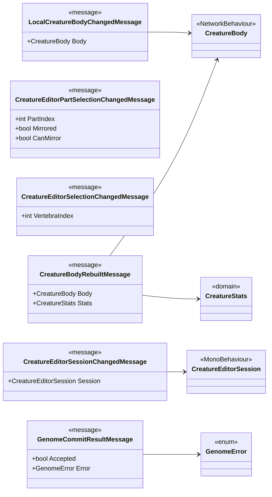

<!-- PLIK GENEROWANY — nie edytuj ręcznie. Źródło: Tools/DiagramGen/gen.mjs -->

# Features/CreatureEditor/Messages

**Puste pudełka** to typy z innych obszarów, pokazane tylko dla kontekstu: `CreatureBody`, `CreatureEditorSession`, `CreatureStats`, `GenomeError`.

Pliki źródłowe (1)

- `Assets/_Project/Features/CreatureEditor/Scripts/Messages/CreatureEditorMessages.cs`

