<!-- PLIK GENEROWANY — nie edytuj ręcznie. Źródło: Tools/DiagramGen/gen.mjs -->

# Features/CreatureEditor/Runtime

```mermaid
classDiagram
    direction LR
    class CreatureBody {
        <<NetworkBehaviour>>
        [SF] CreaturePartCatalog _catalog
        [SF] CreatureBodyBuildSettings _buildSettings
        [SF] CreatureStatTuning _tuning
        [SF] CapsuleCollider _locomotionCollider
        [SF] CreatureRagdoll _ragdoll
        [SF] float _knockdownSeconds
        [SF] float _knockdownImpulseThreshold
        [SF] bool _requireEditorPad
        [Sync] GenomePayload _genome
        [Sync] KnockdownState _knockdown
        [Sync] float _hp
        [Sync] bool _isAlive
        +CreaturePartCatalog Catalog
        +PartRuleSet Rules
        +… i 21 dalszych
    }
    class CreatureGenomeNetworkSerializer {
        <<static>>
        +WriteGenomePayload(Writer, GenomePayload) void$
        +ReadGenomePayload(Reader) GenomePayload$
    }
    class CreatureLocomotion {
        <<MonoBehaviour>>
        [SF] Material _legMaterial
        [SF] float _legThickness
        [SF] LayerMask _groundMask
        [SF] float _footResponsiveness
        [SF] float _idleSpeed
        +IReadOnlyList~Vector3~ HipPositions
    }
    class CreatureRagdoll {
        <<MonoBehaviour>>
        [SF] float _boneDrag
        [SF] float _boneAngularDrag
        [SF] float _swingLimitDegrees
        [SF] float _twistLimitDegrees
        [SF] float _recoverySeconds
        [SF] float _groundProbeHeight
        +bool IsActive
        +int BoneCount
        +Build(BuiltCreatureBody, Rigidbody, Collider, float, int) void
        +Activate(Vector3, int, Vector3) void
        +Deactivate() void
        +ResolveRecoveryPosition(Vector3) Vector3
    }
    class CreatureShover {
        <<NetworkBehaviour>>
        [SF] float _range
        [SF] float _radius
        [SF] float _impulse
        [SF] float _upwardBias
        [SF] uint _cooldownTicks
        +RequestShove() void
        [ServerRpc] CmdShove() void
        [Server] +ServerShove() bool
    }
    class CreatureSuspension {
        <<MonoBehaviour>>
        [SF] float _stiffness
        [SF] float _dampingRatio
        [SF] float _maxDroop
        [SF] LayerMask _groundMask
        +bool IsGrounded
        +float GroundDistance
        +float Compression
        +Simulate(float) void
    }
    class EditorPad {
        <<MonoBehaviour>>
        [SF] Color _gizmoColor
    }
    class GenomePayload {
        <<struct>>
        +byte[] Blob
        +uint Hash
        +bool IsEmpty
        +FromGenome(CreatureGenome) GenomePayload$
        +TryDecode(CreatureGenome, GenomeError) bool
    }
    class KnockdownState {
        <<struct>>
        +bool IsDown
        +uint StartTick
        +Vector3 Impulse
        +byte HitBoneIndex
        +KnockdownState Standing$
    }
    class PlaygroundCreatureController {
        <<NetworkBehaviour>>
        [SF] float _acceleration
        [SF] float _braking
        [SF] CreatureOrbitCamera _orbitCamera
        [Replicate] Move(PlaygroundMoveData, ReplicateState, Channel) void
        [Reconcile] Reconciliation(PlaygroundReconcileData, Channel) void
    }
    class PlaygroundMoveData {
        <<ReplicateData>>
        +float Forward
        +float Strafe
        +float CameraYaw
    }
    class PlaygroundReconcileData {
        <<ReconcileData>>
        +Vector3 Position
        +Vector3 Velocity
        +float Yaw
    }
    class BuiltCreatureBody {
    }
    class CreatureBodyBuildSettings {
        <<ScriptableObject>>
    }
    class CreatureBodyBuilder {
        <<static>>
    }
    class CreatureColliderFitter {
        <<static>>
    }
    class CreatureGenome {
        <<domain>>
    }
    class CreatureOrbitCamera {
        <<MonoBehaviour>>
    }
    class CreaturePartCatalog {
        <<ScriptableObject>>
    }
    class CreaturePartInstance {
        <<struct>>
    }
    class CreatureRigBuilder {
        <<static>>
    }
    class CreatureStatTuning {
        <<domain>>
    }
    class CreatureStats {
        <<domain>>
    }
    class GaitProfile {
        <<domain>>
    }
    class GenomeCodec {
        <<static>>
    }
    class GenomeCommitResultMessage {
        <<message>>
    }
    class GenomeError {
        <<enum>>
    }
    class GenomeLimits {
        <<static>>
    }
    class GenomeStatRules {
        <<static>>
    }
    class GenomeValidationResult {
        <<domain>>
    }
    class GenomeValidator {
        <<static>>
    }
    class LegSpec {
        <<domain>>
    }
    class LocalCreatureBodyChangedMessage {
        <<message>>
    }
    class LocomotionSteering {
        <<static>>
    }
    class PartCategory {
        <<enum>>
    }
    class PartGene {
        <<domain>>
    }
    class PartRule {
        <<domain>>
    }
    class PartRuleSet {
        <<domain>>
    }
    class ProceduralLeg {
    }
    class StableHash {
        <<static>>
    }
    class Suspension {
        <<domain>>
    }

    CreatureBody --> BuiltCreatureBody
    CreatureBody ..> CreatureBodyBuilder
    CreatureBody --> CreatureBodyBuildSettings : inspektor
    CreatureBody ..> CreatureColliderFitter
    CreatureBody --> CreatureGenome
    CreatureBody --> CreaturePartCatalog : inspektor
    CreatureBody --> CreatureRagdoll : inspektor
    CreatureBody ..> CreatureRigBuilder
    CreatureBody --> CreatureStats
    CreatureBody --> CreatureStatTuning : inspektor
    CreatureBody ..> GenomeCommitResultMessage
    CreatureBody --> GenomeError
    CreatureBody ..> GenomeLimits
    CreatureBody --> GenomePayload
    CreatureBody ..> GenomeValidationResult
    CreatureBody ..> GenomeValidator
    CreatureBody --> KnockdownState
    CreatureBody --> PartRuleSet
    CreatureGenomeNetworkSerializer ..> GenomeLimits
    CreatureGenomeNetworkSerializer --> GenomePayload
    CreatureLocomotion ..> CreatureBody
    CreatureLocomotion ..> CreatureGenome
    CreatureLocomotion ..> CreaturePartInstance
    CreatureLocomotion ..> CreatureStats
    CreatureLocomotion ..> GaitProfile
    CreatureLocomotion ..> LegSpec
    CreatureLocomotion ..> PartCategory
    CreatureLocomotion ..> PartGene
    CreatureLocomotion ..> PartRule
    CreatureLocomotion ..> PartRuleSet
    CreatureLocomotion ..> ProceduralLeg
    CreatureRagdoll --> BuiltCreatureBody
    CreatureShover ..> CreatureBody
    CreatureSuspension ..> CreatureBody
    CreatureSuspension ..> CreatureLocomotion
    CreatureSuspension ..> GenomeStatRules
    CreatureSuspension ..> Suspension
    EditorPad ..> CreatureBody
    GenomePayload --> CreatureGenome
    GenomePayload ..> GenomeCodec
    GenomePayload --> GenomeError
    GenomePayload ..> StableHash
    CreatureBody <|-- PlaygroundCreatureController
    PlaygroundCreatureController --> CreatureOrbitCamera : inspektor
    PlaygroundCreatureController ..> CreatureShover
    PlaygroundCreatureController ..> CreatureSuspension
    PlaygroundCreatureController ..> LocalCreatureBodyChangedMessage
    PlaygroundCreatureController ..> LocomotionSteering
    PlaygroundCreatureController --> PlaygroundMoveData
    PlaygroundCreatureController --> PlaygroundReconcileData
```

**Puste pudełka** to typy z innych obszarów, pokazane tylko dla kontekstu: `BuiltCreatureBody`, `CreatureBodyBuildSettings`, `CreatureBodyBuilder`, `CreatureColliderFitter`, `CreatureGenome`, `CreatureOrbitCamera`, `CreaturePartCatalog`, `CreaturePartInstance`, `CreatureRigBuilder`, `CreatureStatTuning`, `CreatureStats`, `GaitProfile`, `GenomeCodec`, `GenomeCommitResultMessage`, `GenomeError`, `GenomeLimits`, `GenomeStatRules`, `GenomeValidationResult`, `GenomeValidator`, `LegSpec`, `LocalCreatureBodyChangedMessage`, `LocomotionSteering`, `PartCategory`, `PartGene`, `PartRule`, `PartRuleSet`, `ProceduralLeg`, `StableHash`, `Suspension`.

Pliki źródłowe (10)

- `Assets/_Project/Features/CreatureEditor/Scripts/Runtime/CreatureBody.cs`
- `Assets/_Project/Features/CreatureEditor/Scripts/Runtime/CreatureGenomeNetworkSerializer.cs`
- `Assets/_Project/Features/CreatureEditor/Scripts/Runtime/CreatureLocomotion.cs`
- `Assets/_Project/Features/CreatureEditor/Scripts/Runtime/CreatureRagdoll.cs`
- `Assets/_Project/Features/CreatureEditor/Scripts/Runtime/CreatureShover.cs`
- `Assets/_Project/Features/CreatureEditor/Scripts/Runtime/CreatureSuspension.cs`
- `Assets/_Project/Features/CreatureEditor/Scripts/Runtime/EditorPad.cs`
- `Assets/_Project/Features/CreatureEditor/Scripts/Runtime/GenomePayload.cs`
- `Assets/_Project/Features/CreatureEditor/Scripts/Runtime/KnockdownState.cs`
- `Assets/_Project/Features/CreatureEditor/Scripts/Runtime/PlaygroundCreatureController.cs`

