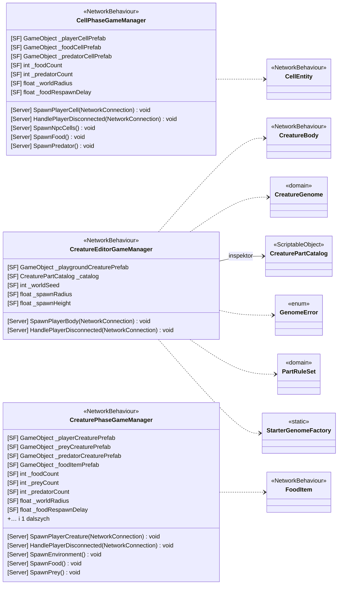

<!-- PLIK GENEROWANY — nie edytuj ręcznie. Źródło: Tools/DiagramGen/gen.mjs -->

# Features/GamePhases

**Puste pudełka** to typy z innych obszarów, pokazane tylko dla kontekstu: `CellEntity`, `CreatureBody`, `CreatureGenome`, `CreaturePartCatalog`, `FoodItem`, `GenomeError`, `PartRuleSet`, `StarterGenomeFactory`.

Pliki źródłowe (3)

- `Assets/_Project/Features/GamePhases/CellPhase/CellPhaseGameManager.cs`
- `Assets/_Project/Features/GamePhases/CreatureEditorPhase/CreatureEditorGameManager.cs`
- `Assets/_Project/Features/GamePhases/CreaturePhase/CreaturePhaseGameManager.cs`

