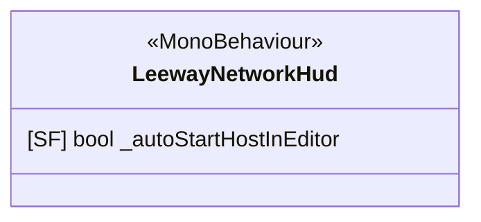

<!-- PLIK GENEROWANY — nie edytuj ręcznie. Źródło: Tools/DiagramGen/gen.mjs -->

# Features/Network

```mermaid
classDiagram
    direction LR
    class LeewayNetworkHud {
        <<MonoBehaviour>>
        [SF] bool _autoStartHostInEditor
    }

```

Pliki źródłowe (1)

- `Assets/_Project/Features/Network/Scripts/LeewayNetworkHud.cs`

