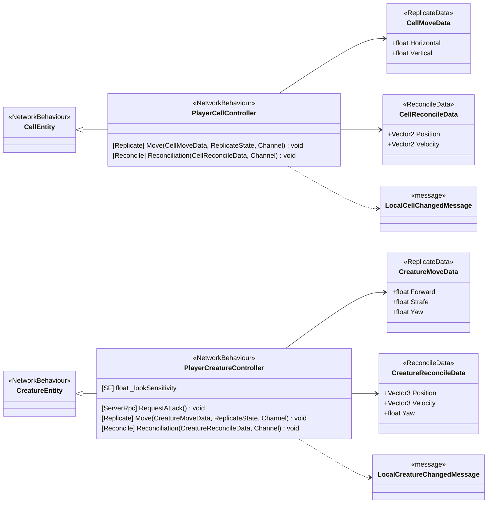

<!-- PLIK GENEROWANY — nie edytuj ręcznie. Źródło: Tools/DiagramGen/gen.mjs -->

# Features/Player

**Puste pudełka** to typy z innych obszarów, pokazane tylko dla kontekstu: `CellEntity`, `CreatureEntity`, `LocalCellChangedMessage`, `LocalCreatureChangedMessage`.

Pliki źródłowe (2)

- `Assets/_Project/Features/Player/Scripts/PlayerCellController.cs`
- `Assets/_Project/Features/Player/Scripts/PlayerCreatureController.cs`

