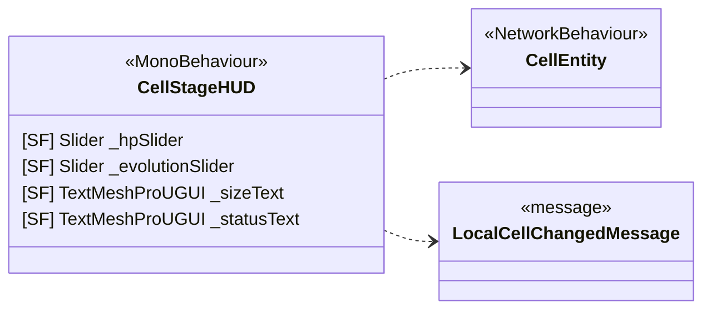

<!-- PLIK GENEROWANY — nie edytuj ręcznie. Źródło: Tools/DiagramGen/gen.mjs -->

# Features/UI

**Puste pudełka** to typy z innych obszarów, pokazane tylko dla kontekstu: `CellEntity`, `LocalCellChangedMessage`.

Pliki źródłowe (1)

- `Assets/_Project/Features/UI/Scripts/CellStageHUD.cs`

