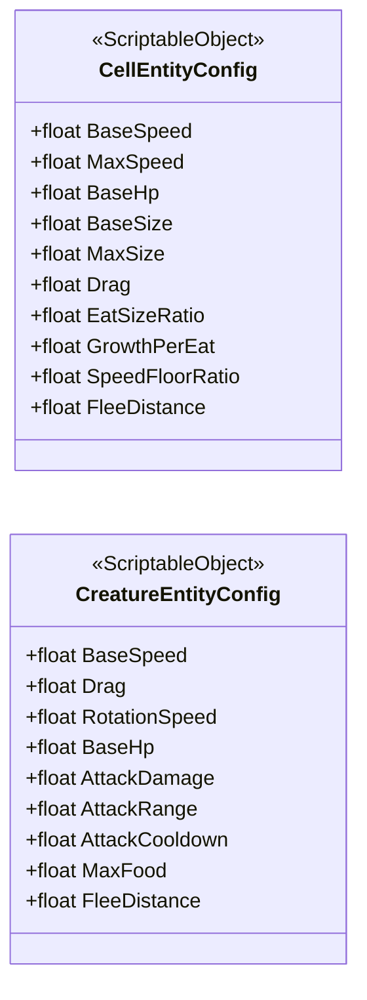

<!-- PLIK GENEROWANY — nie edytuj ręcznie. Źródło: Tools/DiagramGen/gen.mjs -->

# Shared/Data

Pliki źródłowe (2)

- `Assets/_Project/Shared/Data/CellEntityConfig.cs`
- `Assets/_Project/Shared/Data/CreatureEntityConfig.cs`

