<!-- PLIK GENEROWANY — nie edytuj ręcznie. Źródło: Tools/DiagramGen/gen.mjs -->

# Shared/Domain/CreatureEditor

```mermaid
classDiagram
    direction LR
    class AttachmentSite {
        <<enum>>
    }
    class BudgetReport {
        <<domain>>
        +int Spent
        +int Budget
        +int Remaining
        +bool IsAffordable
    }
    class CreatureBudget {
        <<static>>
        +Evaluate(CreatureGenome, PartRuleSet) BudgetReport$
        +CanAfford(CreatureGenome, PartRuleSet, int) bool$
    }
    class CreatureGenome {
        <<domain>>
        +Color32 PrimaryColor
        +Color32 SecondaryColor
        +IReadOnlyList~VertebraGene~ Vertebrae
        +IReadOnlyList~PartGene~ Parts
        +int VertebraCount
        +int PartCount
        +GetVertebra(int) VertebraGene
        +GetPart(int) PartGene
        +AddVertebra(VertebraGene) void
        +InsertVertebra(int, VertebraGene) void
        +SetVertebra(int, VertebraGene) void
        +RemoveVertebraAt(int) void
        +AddPart(PartGene) void
        +SetPart(int, PartGene) void
        +… i 4 dalszych
    }
    class CreatureStats {
        <<domain>>
        +float MaxHp
        +float Mass
        +float MoveSpeed
        +float TurnSpeed
        +float AttackDamage
        +float SenseRadius
    }
    class CreatureStatTuning {
        <<domain>>
        +float BaseHp
        +float HpPerVertebra
        +float BaseMass
        +float MassPerVolume
        +float BaseSpeed
        +float ReferenceMass
        +float MinSpeedFactor
        +float MaxSpeedFactor
        +float BaseTurnSpeed
        +float BaseAttackDamage
        +float BaseSenseRadius
        +float SpeedPerBendPoint
        +CreatureStatTuning Default$
    }
    class DeterministicRng {
        <<domain>>
        +NextUInt() uint
        +NextInt(int) int
        +NextFloat() float
        +NextRange(float, float) float
    }
    class GaitProfile {
        <<domain>>
        +float StepLength
        +float StepHeight
        +float DutyFactor
        +GaitStyle Style
        +For(LegSpec) GaitProfile$
        +IsPlanted(float) bool
        +FootOffset(float) Vector2
        +PhaseOffset(int, int) float$
    }
    class GaitStyle {
        <<enum>>
    }
    class GenomeCodec {
        <<static>>
        +byte Magic$
        +byte Version$
        +byte MinSupportedVersion$
        +int HeaderBytes$
        +int VertebraBytes$
        +int PartBytes$
        +ComputeSize(CreatureGenome) int$
        +Encode(CreatureGenome) byte[]$
        +TryDecode(byte[], CreatureGenome, GenomeError) bool$
        +Upgrade(CreatureGenome, int) CreatureGenome$
    }
    class GenomeEditOperations {
        <<static>>
        +TryAddVertebra(CreatureGenome, int, PartRuleSet, GenomeError) bool$
        +TryExtendSpine(CreatureGenome, bool, PartRuleSet, GenomeError) bool$
        +TryShrinkSpine(CreatureGenome, bool, PartRuleSet, GenomeError) bool$
        +TryRemoveVertebra(CreatureGenome, int, PartRuleSet, GenomeError) bool$
        +TrySetVertebraOffset(CreatureGenome, int, Vector3, GenomeError) bool$
        +TrySetVertebraRadius(CreatureGenome, int, float, GenomeError) bool$
        +TrySetVertebraRotation(CreatureGenome, int, Quaternion, GenomeError) bool$
        +TryAttachPart(CreatureGenome, int, int, bool, PartRuleSet, GenomeError) bool$
        +TryAttachPart(CreatureGenome, PartGene, PartRuleSet, GenomeError) bool$
        +TrySetPartLocalPosition(CreatureGenome, int, Vector3, GenomeError) bool$
        +TrySetPartBone(CreatureGenome, int, int, Vector3, PartRuleSet, GenomeError) bool$
        +TrySetPartRotation(CreatureGenome, int, Quaternion, GenomeError) bool$
        +TrySetPartMirrored(CreatureGenome, int, bool, PartRuleSet, GenomeError) bool$
        +TryDetachPart(CreatureGenome, int, GenomeError) bool$
        +… i 1 dalszych
    }
    class GenomeError {
        <<enum>>
    }
    class GenomeLimits {
        <<static>>
        +int MinVertebrae$
        +int MaxVertebrae$
        +int MaxParts$
        +float MinRadius$
        +float MaxRadius$
        +float MinSegmentLength$
        +float MaxSegmentLength$
        +float MinPartScale$
        +float MaxPartScale$
        +float MaxPartOffset$
        +int MaxBlobBytes$
        +Vector3 DefaultSegmentOffset$
        +float DefaultHeadRadius$
        +float TailTaper$
    }
    class GenomeStatRules {
        <<static>>
        +RideHeight(CreatureGenome, PartRuleSet) float$
        +StandHeight(CreatureGenome, PartRuleSet) float$
        +BodyRadius(CreatureGenome) float$
        +Derive(CreatureGenome, PartRuleSet, CreatureStatTuning) CreatureStats$
    }
    class GenomeValidationResult {
        <<domain>>
        +bool IsValid
        +GenomeError Error
        +int Index
        +GenomeValidationResult Ok$
        +Fail(GenomeError, int) GenomeValidationResult$
    }
    class GenomeValidator {
        <<static>>
        +SiteForBone(int, int) AttachmentSite$
        +Validate(CreatureGenome, PartRuleSet) GenomeValidationResult$
    }
    class LegLimits {
        <<static>>
        +int MinBendPoints$
        +int MaxBendPoints$
        +float MinSegmentLength$
        +float MaxSegmentLength$
    }
    class LegSpec {
        <<domain>>
        +int BendPoints
        +float SegmentLength
        +float StanceFactor$
        +int SegmentCount
        +int JointCount
        +float Reach
        +GaitStyle Style
        +GaitProfile Gait
        +float RideHeight
    }
    class LimbIk {
        <<static>>
        +int DefaultIterations$
        +Solve(Vector3[], float, Vector3, Vector3, int) void$
    }
    class LocomotionSteering {
        <<static>>
        +YawOf(Vector3) float$
        +StepYaw(float, Vector3, float, float) float$
        +Throttle(float, Vector3) float$
        +DesiredDirection(float, float, float) Vector3$
    }
    class PartCategory {
        <<enum>>
    }
    class PartGene {
        <<domain>>
        +int PartId
        +byte BoneIndex
        +Vector3 LocalPosition
        +Quaternion LocalRotation
        +float Scale
        +bool Mirrored
        +Default(int, byte, bool) PartGene$
        +WithBoneIndex(byte) PartGene
        +WithLocalPosition(Vector3) PartGene
        +WithLocalRotation(Quaternion) PartGene
        +WithScale(float) PartGene
        +WithMirrored(bool) PartGene
    }
    class PartOrientation {
        <<static>>
        +Resolve(CreatureGenome, int, Vector3) Quaternion$
        +LookOutward(Vector3, Vector3) Quaternion$
        +ResolveFinal(CreatureGenome, PartGene) Quaternion$
        +SpineTangent(CreatureGenome, int) Vector3$
    }
    class PartPlacement {
        <<static>>
        +Resolve(CreatureGenome, int, Vector3, float, bool) PartPose$
        +Resolve(CreatureGenome, PartGene, float, bool) PartPose$
        +FinalRotation(PartPose, PartGene) Quaternion$
        +BodyRadiusAt(CreatureGenome, int, float) float$
    }
    class PartPose {
        <<domain>>
        +Vector3 Position
        +Quaternion Rotation
        +Vector3 Outward
        +float SurfaceRadius
    }
    class PartRule {
        <<domain>>
        +int PartId
        +PartCategory Category
        +AttachmentSite AllowedSites
        +bool MirrorCapable
        +PartStatContribution Stats
        +int Cost
        +LegSpec Leg
        +float SkinOffset
    }
    class PartRuleSet {
        <<domain>>
        +PartRuleSet Empty$
        +IReadOnlyList~PartRule~ Rules
        +int Count
        +int VertebraCost
        +int Budget
        +TryGetRule(int, PartRule) bool
        +Contains(int) bool
        +GetEligible(PartCategory, AttachmentSite) List~PartRule~
    }
    class PartStatContribution {
        <<domain>>
        +float HpBonus
        +float SpeedBonus
        +float DamageBonus
        +float SenseRadiusBonus
        +float MassKg
    }
    class SpineAnchor {
        <<static>>
        +Vector3 Forward$
        +Offset(CreatureGenome) Vector3$
        +BoneToRoot(CreatureGenome) Matrix4x4[]$
        +Center(CreatureGenome) Vector3$
    }
    class StableHash {
        <<static>>
        +Fnv1a32(string) uint$
        +Fnv1a32(byte[]) uint$
        +PartId(string) int$
    }
    class StarterGenomeFactory {
        <<static>>
        +int StarterVertebraCount$
        +Create(int, PartRuleSet) CreatureGenome$
    }
    class Suspension {
        <<domain>>
        +float Stiffness
        +float DampingRatio
        +float MaxDroop
        +Suspension Default$
        +float Damping
        +Acceleration(float, float, float, float) float
        +IsGrounded(float, float) bool
    }
    class VertebraGene {
        <<domain>>
        +Vector3 LocalOffset
        +Quaternion LocalRotation
        +float Radius
        +WithOffset(Vector3) VertebraGene
        +WithRotation(Quaternion) VertebraGene
        +WithRadius(float) VertebraGene
    }

    CreatureBudget --> BudgetReport
    CreatureBudget --> CreatureGenome
    CreatureBudget ..> PartRule
    CreatureBudget --> PartRuleSet
    CreatureGenome --> PartCategory
    CreatureGenome --> PartGene
    CreatureGenome ..> PartRule
    CreatureGenome --> PartRuleSet
    CreatureGenome --> VertebraGene
    GaitProfile --> GaitStyle
    GaitProfile --> LegSpec
    GenomeCodec --> CreatureGenome
    GenomeCodec --> GenomeError
    GenomeCodec ..> GenomeLimits
    GenomeCodec ..> PartGene
    GenomeCodec ..> VertebraGene
    GenomeEditOperations ..> AttachmentSite
    GenomeEditOperations ..> CreatureBudget
    GenomeEditOperations --> CreatureGenome
    GenomeEditOperations --> GenomeError
    GenomeEditOperations ..> GenomeLimits
    GenomeEditOperations --> GenomeValidationResult
    GenomeEditOperations ..> GenomeValidator
    GenomeEditOperations --> PartGene
    GenomeEditOperations ..> PartPlacement
    GenomeEditOperations ..> PartRule
    GenomeEditOperations --> PartRuleSet
    GenomeEditOperations ..> VertebraGene
    GenomeStatRules --> CreatureGenome
    GenomeStatRules --> CreatureStats
    GenomeStatRules --> CreatureStatTuning
    GenomeStatRules ..> PartCategory
    GenomeStatRules ..> PartGene
    GenomeStatRules ..> PartPlacement
    GenomeStatRules ..> PartPose
    GenomeStatRules ..> PartRule
    GenomeStatRules --> PartRuleSet
    GenomeStatRules ..> PartStatContribution
    GenomeStatRules ..> SpineAnchor
    GenomeValidationResult --> GenomeError
    GenomeValidator --> AttachmentSite
    GenomeValidator ..> CreatureBudget
    GenomeValidator --> CreatureGenome
    GenomeValidator ..> GenomeCodec
    GenomeValidator ..> GenomeError
    GenomeValidator ..> GenomeLimits
    GenomeValidator --> GenomeValidationResult
    GenomeValidator ..> PartGene
    GenomeValidator ..> PartRule
    GenomeValidator --> PartRuleSet
    GenomeValidator ..> VertebraGene
    LegSpec --> GaitProfile
    LegSpec --> GaitStyle
    LegSpec ..> LegLimits
    PartOrientation --> CreatureGenome
    PartOrientation --> PartGene
    PartOrientation ..> VertebraGene
    PartPlacement --> CreatureGenome
    PartPlacement --> PartGene
    PartPlacement ..> PartOrientation
    PartPlacement --> PartPose
    PartPlacement ..> SpineAnchor
    PartPlacement ..> VertebraGene
    PartRule --> AttachmentSite
    PartRule --> LegSpec
    PartRule --> PartCategory
    PartRule --> PartStatContribution
    PartRuleSet --> AttachmentSite
    PartRuleSet --> PartCategory
    PartRuleSet --> PartRule
    SpineAnchor --> CreatureGenome
    SpineAnchor ..> VertebraGene
    StarterGenomeFactory ..> AttachmentSite
    StarterGenomeFactory --> CreatureGenome
    StarterGenomeFactory ..> DeterministicRng
    StarterGenomeFactory ..> GenomeEditOperations
    StarterGenomeFactory ..> GenomeLimits
    StarterGenomeFactory ..> GenomeValidator
    StarterGenomeFactory ..> PartCategory
    StarterGenomeFactory ..> PartGene
    StarterGenomeFactory ..> PartRule
    StarterGenomeFactory --> PartRuleSet
    StarterGenomeFactory ..> VertebraGene
```

Pliki źródłowe (23)

- `Assets/_Project/Shared/Domain/CreatureEditor/CreatureBudget.cs`
- `Assets/_Project/Shared/Domain/CreatureEditor/CreatureGenome.cs`
- `Assets/_Project/Shared/Domain/CreatureEditor/CreatureStats.cs`
- `Assets/_Project/Shared/Domain/CreatureEditor/DeterministicRng.cs`
- `Assets/_Project/Shared/Domain/CreatureEditor/GaitProfile.cs`
- `Assets/_Project/Shared/Domain/CreatureEditor/GenomeCodec.cs`
- `Assets/_Project/Shared/Domain/CreatureEditor/GenomeEditOperations.cs`
- `Assets/_Project/Shared/Domain/CreatureEditor/GenomeError.cs`
- `Assets/_Project/Shared/Domain/CreatureEditor/GenomeLimits.cs`
- `Assets/_Project/Shared/Domain/CreatureEditor/GenomeValidator.cs`
- `Assets/_Project/Shared/Domain/CreatureEditor/LegSpec.cs`
- `Assets/_Project/Shared/Domain/CreatureEditor/LimbIk.cs`
- `Assets/_Project/Shared/Domain/CreatureEditor/PartCategory.cs`
- `Assets/_Project/Shared/Domain/CreatureEditor/PartGene.cs`
- `Assets/_Project/Shared/Domain/CreatureEditor/PartOrientation.cs`
- `Assets/_Project/Shared/Domain/CreatureEditor/PartPlacement.cs`
- `Assets/_Project/Shared/Domain/CreatureEditor/PartRule.cs`
- `Assets/_Project/Shared/Domain/CreatureEditor/PartStatContribution.cs`
- `Assets/_Project/Shared/Domain/CreatureEditor/SpineAnchor.cs`
- `Assets/_Project/Shared/Domain/CreatureEditor/StableHash.cs`
- `Assets/_Project/Shared/Domain/CreatureEditor/StarterGenomeFactory.cs`
- `Assets/_Project/Shared/Domain/CreatureEditor/Suspension.cs`
- `Assets/_Project/Shared/Domain/CreatureEditor/VertebraGene.cs`

