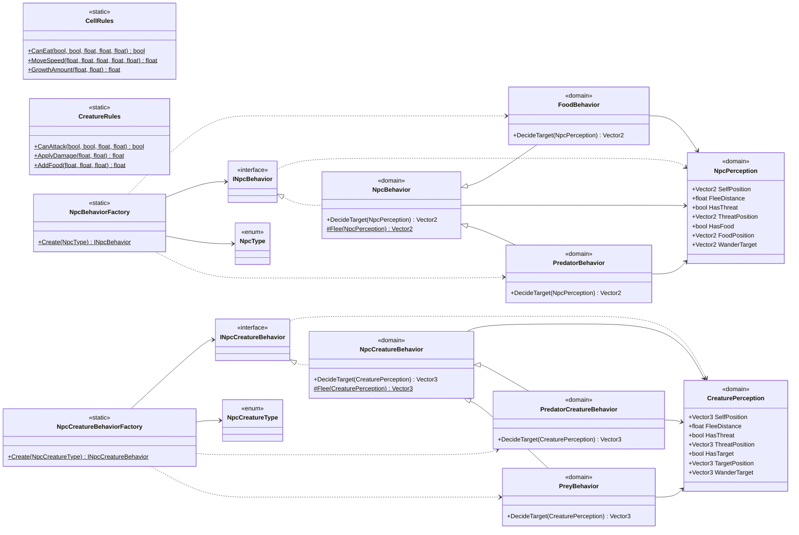

<!-- PLIK GENEROWANY — nie edytuj ręcznie. Źródło: Tools/DiagramGen/gen.mjs -->

# Shared/Domain

Pliki źródłowe (4)

- `Assets/_Project/Shared/Domain/CellRules.cs`
- `Assets/_Project/Shared/Domain/CreatureRules.cs`
- `Assets/_Project/Shared/Domain/NpcBehaviors.cs`
- `Assets/_Project/Shared/Domain/NpcCreatureBehaviors.cs`

